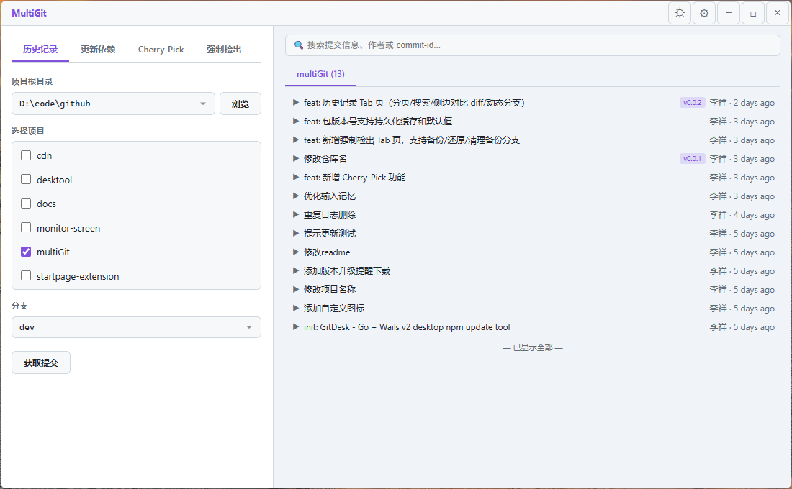

# DepDash

使用 Go + Wails v2 构建的桌面端批量 npm 依赖更新工具。



## 功能

- 选择项目根目录，自动扫描所有 Git 子项目
- 多选项目、多选包，填写目标版本号
- 自动执行：stash → 切换分支 → pull → 修改 package.json → npm install → commit → push
- 失败自动回滚，完成后恢复原分支和本地修改
- 支持自动升版本号（可在设置中配置）
- 实时终端输出，所有命令过程可见
- 亮色 / 暗色主题切换
- 启动时检查 GitHub Releases 新版本

## 技术栈

| 层 | 技术 |
|---|------|
| 桌面框架 | Wails v2 |
| 后端 | Go |
| 前端 | HTML + CSS + vanilla JS |
| UI 风格 | 亮色/暗色双主题，自定义无边框标题栏 |

## 开发

```powershell
# 安装依赖
go mod tidy

# 开发模式（热重载）
wails dev

# 生产构建（含自定义图标 + 版本号）
build.bat
```

构建产物位于 `build/bin/depdash.exe`。

## 配置

首次运行自动在 `%APPDATA%/depdash/config.json` 生成配置文件：

```json
{
    "registry": "https://registry.npmmirror.com",
    "branches": ["main", "develop"],
    "packages": [],
    "autoBumpProjects": [],
    "rootPath": "",
    "updateRepo": "ai-written/depdash"
}
```

| 字段 | 说明 |
|------|------|
| `registry` | npm 镜像源地址 |
| `branches` | 可选的分支列表 |
| `packages` | 常用包名（勾选后填版本号） |
| `autoBumpProjects` | 需要自动升版本号的项目目录名 |
| `rootPath` | 上次使用的项目根目录（自动记忆） |
| `updateRepo` | GitHub 仓库 `user/repo`，用于版本更新检查（留空禁用） |

## 工作流程

1. 点击 **设置** 配置镜像源、分支和常用包
2. 点击 **浏览** 选择项目根目录
3. 选择目标分支
4. 勾选要更新的项目
5. 勾选要更新的包，填写目标版本号
6. 点击 **执行更新**
7. 右侧终端实时显示执行过程

## CI/CD

推送 `v*` 标签自动触发 GitHub Actions 构建和发布：

```powershell
git tag v1.0.0
git push origin v1.0.0
```

## License

[MIT](LICENSE)
